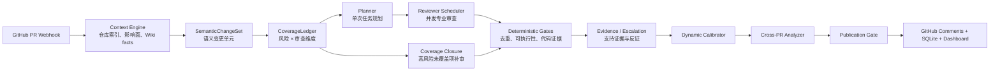

# ReviewForge v3

ReviewForge 是面向 GitHub Pull Request 的 AI 代码审查系统。它把一次 PR 拆成可追踪的语义变更单元，用覆盖账本规划审查范围，再通过多 Reviewer、确定性规则、证据核验和发布闸门生成可执行的审查意见。

v3 的目标不是“让模型自由阅读整个仓库”，而是让每个高风险变更都有明确的审查维度、证据来源和终止原因，同时记录延迟、Token 与最终裁决，便于持续评测和调优。

## 核心能力

- 语义变更建模：按函数、类、配置区块等单位编译 `SemanticChangeSet`
- 覆盖驱动审查：用 `CoverageLedger` 跟踪 correctness、contract、security、testing、localization、performance、compatibility、cross-PR 等维度
- 九类专业 Reviewer：安全、正确性、性能、测试、国际化、依赖、可访问性、文档和风格
- 分层取证：确定性检测器、仓库上下文工具、风险区间升级核验、动态校准与最终发布闸门
- 跨 PR 分析：结合持久化历史识别前后提交之间的契约与行为冲突
- 多语言支持：通用审查能力加 Python、TypeScript 等语言 Skill，并提供 Go、Java、Ruby、Rust、Vue 等评测样本
- 成本可观测：按 run 和 agent 记录模型调用与 Token 使用量
- GitHub 原生接入：Webhook 触发、PR inline comment、自动部署、健康检查与失败回滚
- 管理控制台：查看审查记录、发现、趋势、热点、Reviewer 表现与 Token 指标

## v3 审查流程



当前默认配置启用 v3 覆盖账本和最终发布闸门；证据验证器保留但默认关闭，`coverage_gap` 也默认关闭，只有经过基准验证后才建议在生产开启。Security Reviewer 使用受限工具循环，其余 Reviewer 默认单次执行，以控制 Token 和延迟。

更完整的契约说明见 [docs/v3-architecture.md](docs/v3-architecture.md)，当前评测边界与目标见 [docs/v3-benchmark-diagnosis.md](docs/v3-benchmark-diagnosis.md)。

如果希望从产品创作者视角系统理解架构、迭代过程、效果边界和面试表达，请阅读 [ReviewForge v3 创作者完全理解与面试表达手册](docs/v3-creator-interview-guide.md)。

## 快速开始

### Docker

```bash
git clone https://github.com/Wayne0607/ReviewForge.git
cd ReviewForge
cp .env.example .env
# 编辑 .env，至少配置 GitHub、LLM 和 API Token
docker compose up -d --build
```

服务默认只绑定 `127.0.0.1:8000`。验证状态：

```bash
curl http://127.0.0.1:8000/health
```

无需真实 GitHub 或模型的本地演示：

```bash
docker compose --profile mock up --build reviewforge-mock
```

Mock 服务位于 `127.0.0.1:8001`。

### 本地开发

需要 Python 3.11+、[uv](https://docs.astral.sh/uv/) 和 Node.js 20+。

```bash
cd backend
uv sync --frozen
uv run reviewforge spec-check

cd ../frontend
npm ci
npm run build

cd ../backend
uv run reviewforge serve --host 127.0.0.1 --port 8000
```

前端热更新模式：

```bash
cd frontend
npm run dev
```

Vite 默认运行在 `http://localhost:5173`，并将 `/api` 请求代理到后端。

## 配置

复制 `.env.example` 后配置以下变量：

```dotenv
GITHUB_TOKEN=github-token
GITHUB_WEBHOOK_SECRET=webhook-secret

LLM_BASE_URL=https://your-openai-compatible-endpoint/v1
LLM_API_KEY=llm-api-key
REVIEWFORGE_MODEL=your-model

REVIEWFORGE_API_TOKEN=dashboard-api-token
REVIEWFORGE_CORS_ORIGINS=http://localhost:5173
```

`reviewforge.yaml` 管理 Reviewer、模型 profile、置信度阈值、升级核验、发布闸门和 v3 参数。环境变量优先于 YAML。模型服务只要兼容 OpenAI Chat Completions 接口即可；可以为快速任务和高精度任务配置不同 profile。

部署完成后也可以在控制台的“系统信息 → 模型服务”中测试、保存或恢复模型配置，无需重启服务。控制台采用单管理员模式，不引入用户系统：

- `REVIEWFORGE_API_TOKEN` 统一保护管理 API
- 生产控制台应放在 HTTPS 反向代理之后，避免 API Token 和新密钥在传输途中泄露
- API Key 通过 Fernet 加密保存在 `.reviewforge/llm-settings.enc`，接口只返回是否已配置和末四位
- 主密钥使用 `REVIEWFORGE_SECRETS_KEY`；未设置时自动生成 `.reviewforge/master.key` 并限制为服务账号读写
- 保存前会发起最小 Chat Completions 请求，成功后原子切换；运行中的审查不受影响
- 默认拒绝公网 HTTP、云元数据和内网地址，内网模型需显式设置 `REVIEWFORGE_ALLOW_PRIVATE_LLM_ENDPOINTS=1`
- 控制台配置优先于环境变量/YAML；“恢复启动配置”会删除加密覆盖并重新使用环境变量/YAML

生产前至少检查：

```bash
cd backend
uv run reviewforge spec-check
uv run pytest -q
uv run ruff check .
uv run ruff format --check .
```

## GitHub Webhook

在目标仓库的 `Settings → Webhooks` 中创建 Webhook：

- Payload URL：`https://<host>/webhook/github`
- Content type：`application/json`
- Secret：与 `GITHUB_WEBHOOK_SECRET` 一致
- Events：选择 Pull requests

除 `/health` 和 GitHub Webhook 外，管理 API 需要 `REVIEWFORGE_API_TOKEN`。

常用端点：

| 端点 | 用途 |
| --- | --- |
| `GET /health` | 服务健康检查 |
| `POST /webhook/github` | 接收 GitHub PR 事件 |
| `GET /api/v1/specs` | Agent、Tool 与 Skill 注册信息 |
| `GET /api/v1/config` | 当前运行配置 |
| `GET /api/v1/dashboard/reviews` | 审查历史 |
| `GET /api/v1/dashboard/tokens/summary` | Token 汇总 |
| `GET /api/v1/admin/skills` | Skill 管理 |
| `GET /api/v1/admin/agents` | Reviewer 管理 |
| `GET /api/v1/admin/llm-settings` | 脱敏后的当前模型配置 |
| `POST /api/v1/admin/llm-settings/test` | 测试候选模型配置 |
| `POST /api/v1/admin/llm-settings` | 测试、加密保存并热切换 |
| `POST /api/v1/admin/llm-settings/reset` | 恢复环境变量/YAML 启动配置 |

## 评测

评测定义位于 `backend/eval/`，可执行入口位于 `backend/scripts/`，所有临时结果和日志统一写入 `backend/eval/artifacts/`。该目录只保留说明文件，不提交运行产物。

确定性 golden gauntlet：

```bash
cd backend
uv run python scripts/eval_gauntlet.py \
  --scanner-only \
  --out eval/artifacts/gauntlet-scanner.json
```

对真实 PR 导出的 findings、Token 与盲测 manifest 做逐行评分：

```bash
cd backend
uv run python scripts/eval_live_benchmark.py \
  --manifest eval/artifacts/manifest.json \
  --findings eval/artifacts/findings.json \
  --tokens eval/artifacts/tokens.json \
  --out eval/artifacts/live-benchmark.json
```

指标包括 TP、FP、FN、Precision、Recall、F1、严重级别召回、干净 PR 误报率、延迟和 Token。产品对比结论必须使用未参与调优的 holdout PR，并由独立裁判复核；仓库不把训练集成绩描述为行业领先。

## 项目结构

```text
ReviewForge/
├─ .github/workflows/       # main 分支 CI 与自动部署
├─ backend/
│  ├─ eval/                 # golden 数据与统一评测产物目录
│  ├─ scripts/              # gauntlet / live benchmark 入口
│  ├─ src/reviewforge/
│  │  ├─ api/               # Webhook、Dashboard、Admin API
│  │  ├─ core/              # 配置、状态、事件、数据库、Spec
│  │  ├─ engine/            # v3 编排、语义差异、覆盖、证据与 Reviewer
│  │  ├─ eval/              # 评分实现
│  │  ├─ skills/            # Reviewer 方法与语言规则
│  │  └─ tools/             # GitHub 与受控工具网关
│  └─ tests/
├─ frontend/                # React + TypeScript 控制台
├─ test_fixtures/           # 多语言基准样本
├─ docs/                    # v3 架构与评测诊断
├─ scripts/                 # 部署、服务器初始化与运维脚本
└─ reviewforge.yaml         # 生产默认配置
```

## 自动部署

推送到 `main` 后，GitHub Actions 会依次执行 Ruff、pytest、构建部署 bundle、上传服务器、重启服务并进行健康检查。部署脚本带进程锁和失败回滚。

需要在 GitHub Actions 中配置：

- `SERVER_HOST`
- `SERVER_USER`
- `SERVER_SSH_KEY`

服务器默认目录为 `/opt/reviewforge`，服务名为 `reviewforge`。相关脚本位于 `scripts/deploy.sh` 与 `scripts/setup-server.sh`。

## 开发约定

新增 Reviewer 时：

1. 在 `backend/src/reviewforge/core/specs.py` 注册 `AgentSpec`
2. 在 `backend/src/reviewforge/skills/` 添加 Skill
3. 在 `backend/src/reviewforge/engine/reviewers.py` 实现 Reviewer
4. 在 prompt builder 中接入对应审查方法
5. 运行 `spec-check`、Ruff 与 pytest

Reviewer 不直接发布评论；所有发现必须经过统一状态存储、验证与发布链路。
