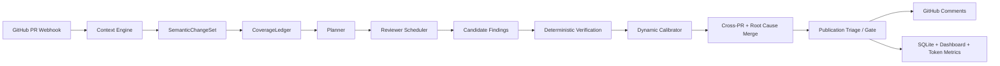

# ReviewForge v3

面向小型研发团队的自部署 AI Pull Request 审查系统。

ReviewForge 不把一次代码审查当成单轮聊天，而是把 PR 编译成语义变更单元，规划需要覆盖的风险维度，让专业 Reviewer 并行取证，再通过确定性规则、动态校准、根因合并和最终发布门控筛掉无法证明或重复的问题。最终评论、审查过程、延迟和 Token 消耗都会被记录并展示在管理控制台中。

> 当前状态：v3 是短期稳定版，审查核心基线标记为
> `v3-final-50pr-baseline-20260730`。生产默认配置已经完成固定 50 PR
> 严格评测，适合约 10 人团队异步使用。它不是零误报工具，也不应替代
> 测试、静态分析和人工审批。

## 当前效果

2026-07-30，ReviewForge v3 在固定 50 PR Martian Code Review Benchmark
上与 Qodo v2 进行了同口径严格评测。两组候选使用相同金标、相同
MiniMax-M3 裁判和相同重复规则；同一根因只有最强候选计为命中，其余
重复候选计入误报。裁判允许一条候选覆盖多个不同金标，因此 TP 与 FP
之和可能略大于原始评论数。

| 指标 | ReviewForge v3 | Qodo v2 |
| --- | ---: | ---: |
| 评测 PR | 50 | 50 |
| 候选评论 | 151 | 104 |
| TP / FP / FN | 65 / 87 / 72 | 62 / 45 / 75 |
| Precision | 42.76% | **57.94%** |
| Recall | **47.45%** | 45.26% |
| F1 | 44.98% | **50.82%** |

ReviewForge 多命中 3 个金标问题，召回率高 2.19 个百分点，但严格口径下
多出 42 个误报，F1 低 5.84 个百分点，因此当前版本尚未在总体审查效果上
超过 Qodo。相对上一轮 ReviewForge 全量测试，本版在召回仅下降 0.73 个
百分点的情况下，将评论数减少 40.08%、Token 减少 21.26%、误报减少
93 条，F1 从 34.46% 提升到 44.98%。

50 PR 共消耗 16,577,583 个审查 Token，平均每个 PR 约 331,552；三分片
实际运行约 3 小时 45 分钟。结果说明当前主要瓶颈已不是发现候选问题，
而是发布层的语义去重、误报抑制、空审查恢复和内部 Reviewer 失败恢复。

详细口径、成本、可靠性观察和限制见
[docs/benchmark.md](docs/benchmark.md)。

## 核心能力

- **语义变更建模**：按函数、类、配置区块等边界生成 `SemanticChangeSet`
- **覆盖驱动规划**：`CoverageLedger` 追踪 correctness、contract、security、testing、localization、performance、compatibility 与 cross-PR 等维度
- **专业 Reviewer**：安全、正确性、性能、测试、国际化、依赖、可访问性、文档与代码质量分工审查
- **受控上下文工具**：Reviewer 可读取文件、搜索符号、查看 diff 和引用资料，不直接获得无限制仓库访问
- **模型无关过滤**：坐标校验、确定性证据、去重与根因聚类由纯逻辑层执行
- **分层验证**：动态校准、Escalation、Publication Triage 与 Publication Gate 逐级核实候选
- **跨 PR 分析**：利用持久化历史识别前后提交之间的契约和行为冲突
- **按角色模型路由**：Planner、Fast Review、Deep Review、Verifier、Publication Gate 可分别配置模型、端点与密钥
- **单管理员控制台**：不引入用户系统，提供审查记录、趋势、Reviewer 表现、Token 统计和模型热切换
- **安全自部署**：Webhook 签名验证、管理 API Token、加密模型密钥、HTTPS 反向代理与内网端点保护
- **自动部署保护**：`main` 推送后执行 lint、测试、部署锁、服务重启、健康检查和失败回滚

## 审查架构



核心原则：

1. LLM 负责发现、理解和解释问题。
2. 纯逻辑层负责可复现的校验、去重、预算和状态流转。
3. 能从 diff 完整证明的窄规则不依赖具体模型裁决。
4. 普通语义判断必须经过最终证据门控，无法核实则不发布。
5. Reviewer 不能直接向 GitHub 写评论，所有结果统一经过编排器。

更完整的内部契约见 [docs/v3-architecture.md](docs/v3-architecture.md)。

## 快速开始

### Docker Compose

```bash
git clone https://github.com/Wayne0607/ReviewForge.git
cd ReviewForge
cp .env.example .env
# 编辑 .env，填写 GitHub、模型服务和管理 API 配置
docker compose up -d --build
curl http://127.0.0.1:8000/health
```

服务默认只绑定 `127.0.0.1:8000`。生产环境应通过 HTTPS 反向代理访问，不要直接暴露应用端口。

无需真实 GitHub 或模型服务的本地演示：

```bash
docker compose --profile mock up --build reviewforge-mock
```

Mock 服务位于 `127.0.0.1:8001`。

### 本地开发

需要 Python 3.11+、[uv](https://docs.astral.sh/uv/) 和 Node.js 20+。

```bash
cd backend
uv sync --frozen
uv run reviewforge spec-check
uv run pytest -q

cd ../frontend
npm ci
npm run build

cd ../backend
uv run reviewforge serve --host 127.0.0.1 --port 8000
```

前端开发服务器：

```bash
cd frontend
npm run dev
```

Vite 默认运行在 `http://localhost:5173`，并将 `/api` 代理到后端。

## 配置

最低启动配置：

```dotenv
GITHUB_TOKEN=github-token
GITHUB_WEBHOOK_SECRET=webhook-secret

LLM_BASE_URL=https://your-openai-compatible-endpoint/v1
LLM_API_KEY=llm-api-key
REVIEWFORGE_MODEL=your-model

REVIEWFORGE_API_TOKEN=dashboard-api-token
REVIEWFORGE_CORS_ORIGINS=https://review.example.com
```

优先级为：**控制台加密配置 > 环境变量 > `reviewforge.yaml` > 程序默认值**。

部署完成后可在“系统信息 → 模型服务”中测试、保存或恢复模型配置，无需重启服务。全局模型之外，以下五个角色可以分别设置 Base URL、模型和 API Key：

| 角色 | 主要职责 |
| --- | --- |
| Planner | 规划 PR 审查任务 |
| Fast Review | 性能、测试、国际化、依赖、文档、可访问性等轻量任务 |
| Deep Review | 安全、正确性与高风险覆盖任务 |
| Verifier | 动态校准、跨 PR、证据验证与 Escalation |
| Publication Gate | 评论发布前的独立最终核验 |

模型配置安全措施：

- API Key 使用 Fernet 加密保存在 `.reviewforge/llm-settings.enc`
- 主密钥来自 `REVIEWFORGE_SECRETS_KEY`，未设置时生成权限为 `0600` 的 `.reviewforge/master.key`
- API 只返回密钥是否存在及末四位，不回传明文
- 保存前执行最小连接测试，成功后原子切换；进行中的审查继续使用旧配置
- 默认拒绝公网 HTTP、云元数据地址和内网地址
- 确需使用内网模型时设置 `REVIEWFORGE_ALLOW_PRIVATE_LLM_ENDPOINTS=1`
- `REVIEWFORGE_API_TOKEN` 统一保护管理 API；本项目没有多用户系统

## GitHub Webhook

在目标仓库的 `Settings → Webhooks` 中创建：

- Payload URL：`https://<host>/webhook/github`
- Content type：`application/json`
- Secret：与 `GITHUB_WEBHOOK_SECRET` 相同
- Events：Pull requests

除 `/health` 和 GitHub Webhook 外，管理 API 均需要 `REVIEWFORGE_API_TOKEN`。

## 常用接口

| 接口 | 用途 |
| --- | --- |
| `GET /health` | 健康检查 |
| `POST /webhook/github` | 接收 GitHub PR 事件 |
| `GET /api/v1/specs` | Agent、Tool 与 Skill 注册信息 |
| `GET /api/v1/config` | 当前运行配置 |
| `GET /api/v1/dashboard/reviews` | 审查历史 |
| `GET /api/v1/dashboard/tokens/summary` | Token 汇总 |
| `GET /api/v1/admin/llm-settings` | 脱敏后的模型配置 |
| `POST /api/v1/admin/llm-settings/test` | 测试候选模型配置 |
| `POST /api/v1/admin/llm-settings` | 测试、加密保存并热切换 |
| `POST /api/v1/admin/llm-settings/reset` | 恢复启动配置 |

## 评测与质量检查

仓库只保留可复现的评测代码、golden 数据和说明，不提交运行日志、数据库或结果产物。生成内容统一写入已忽略的 `backend/eval/artifacts/` 或 `.reviewforge/`。

```bash
cd backend

# 确定性扫描基准
uv run python scripts/eval_gauntlet.py \
  --scanner-only \
  --out eval/artifacts/gauntlet-scanner.json

# 真实 PR 导出结果的统一评分
uv run python scripts/eval_live_benchmark.py \
  --manifest eval/artifacts/manifest.json \
  --findings eval/artifacts/findings.json \
  --tokens eval/artifacts/tokens.json \
  --out eval/artifacts/live-benchmark.json

# 提交前检查
uv run reviewforge spec-check
uv run ruff check .
uv run ruff format --check .
uv run pytest -q
```

指标包括 TP、FP、FN、Precision、Recall、F1、严重级别召回、干净 PR 误报率、延迟和 Token。任何“超过某产品”的结论都应使用未参与调优的 holdout PR 和独立裁判复核。

## 项目结构

```text
ReviewForge/
├─ .github/workflows/       # main 分支 CI 与自动部署
├─ backend/
│  ├─ eval/                 # golden 数据与评测说明
│  ├─ scripts/              # gauntlet / live benchmark
│  ├─ src/reviewforge/
│  │  ├─ api/               # Webhook、Dashboard、Admin API
│  │  ├─ core/              # 配置、状态、数据库、事件与 Agent Spec
│  │  ├─ engine/            # v3 编排、上下文、覆盖、验证与 Reviewer
│  │  ├─ eval/              # 统一评分实现
│  │  ├─ skills/            # Reviewer 方法与语言规则
│  │  └─ tools/             # GitHub 与受控工具网关
│  └─ tests/
├─ frontend/                # React + TypeScript 管理控制台
├─ test_fixtures/           # 多语言确定性测试样本
├─ docs/                    # 架构和基准说明
├─ scripts/                 # 部署、初始化与运维脚本
└─ reviewforge.yaml         # 生产默认策略
```

## 自动部署

推送到 `main` 后，GitHub Actions 会执行：

1. Ruff lint 与格式检查
2. 完整 pytest
3. 构建 Git bundle 并上传服务器
4. 使用进程锁部署，重启 `reviewforge` 服务
5. 执行健康检查；失败时自动回滚

需要配置以下 GitHub Actions Secrets：

- `SERVER_HOST`
- `SERVER_USER`
- `SERVER_SSH_KEY`

默认服务器目录为 `/opt/reviewforge`，systemd 服务名为 `reviewforge`。

## 开发约定

新增 Reviewer 时：

1. 在 `backend/src/reviewforge/core/specs.py` 注册 `AgentSpec`
2. 在 `backend/src/reviewforge/skills/` 添加 Skill
3. 在 `backend/src/reviewforge/engine/reviewers.py` 实现 Reviewer
4. 在 prompt builder 接入对应方法
5. 运行 `spec-check`、Ruff 和 pytest

所有 Reviewer 输出都必须经过统一状态存储、验证和发布链路，禁止绕过编排器直接发布评论。
