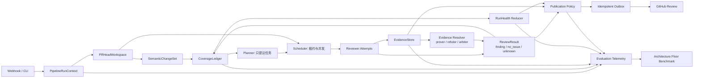

# ReviewForge Architecture Floor v2 提案

> 状态：架构审计提案，不代表目标架构已经实现。
>
> 基线：`origin/main@da0d476d1d40ea46be33c2f5e998f6f629e01efb`。
>
> 目标：提高模型无关的质量下限；多模型路由只用于在此基础上探索上限。

## 1. 产品定位与决策原则

ReviewForge 不追求 Copilot 式的即时反馈，也不承诺找出每个 PR 中的每一个缺陷。它面向 PR 频率较低的小团队，可以用更长的审查时间换取更可信的结论，并优先避免两种伤害：把未完成的审查伪装成“没有问题”，以及发布缺少可复核证据的评论。

因此，架构优化目标不是平均派出更多 Agent，而是让最差一次运行也具备以下性质：

- 审查的是同一个、不可漂移的 PR head；
- 每个高风险审查单元都有可解释的覆盖状态；
- “发现问题”“有证据地未发现问题”“无法得出结论”三者不会混淆；
- Agent、工具、模型或发布失败会进入可恢复终态，不会被计作成功；
- 发布评论可以从原始证据和确定性决策重建；
- 更换模型不会改变运行协议、证据标准或基准口径。

这也定义了三个非目标：亚分钟反馈、100% bug recall、未经重复盲测的“全面超过 Qodo”结论。

## 2. 当前架构的主要问题

以下优先级同时考虑了对质量下限的影响和修复顺序。后续层依赖前一层提供可信数据，不能倒置。

| 优先级 | 根因 | 已确认的代码事实 | 对下限的影响 |
| --- | --- | --- | --- |
| P0 | 审查结论与运行健康混在一起 | Reviewer 的主返回值仍是 `list[Finding]`；旧协议把合法空数组当作一次有效输出。Scheduler 隔离并发任务异常，终态需要 Orchestrator 另行汇总 | 空结果可能是干净、预算耗尽、输出损坏或工具失败；若不显式区分，召回下限不可测 |
| P0 | 覆盖不是调度和发布的硬约束 | V3 `CoverageLedger` 可用但默认关闭；Planner 仍决定大部分 Reviewer 是否触达，未命中单元的 broad pass 当前进入 `ABSTAINED`，还没有由证据化 `NO_ISSUE` 闭环 | Planner 漏派、Reviewer 失败或“看过但没结论”会形成静默覆盖洞 |
| P0 | 候选 Finding 不是证据 | 常规 Reviewer 直接生成 Finding；V3 Evidence Verifier 只在启用时工作，默认可处于 shadow，且证据项目前主要来自 finding 所在的单条 changed line | 多个 Agent 可能只是重复同一判断，无法证明触发路径、被违反契约及反证已检查 |
| P1 | PR head 身份和可读上下文没有统一快照 | `read_file` 使用 `head_sha`，但 `search_code` 仍按仓库搜索且没有同一 head 的显式限定；当前工作树刚补充 `head_repo/head_ref` 等元数据，尚无统一的 `PRHeadWorkspace` | fork PR、默认分支漂移、重试或并发运行可能读到不同世界，证据无法稳定复放 |
| P1 | “多 Agent”主要是角色并行，不等于证据独立 | Planner、各 Reviewer、prover/refuter/arbiter 是不同调用或角色；V3 verifier 默认仍可复用同一个 calibrator 底模，并接收相同 diff | 同一模型先验和同一上下文会产生相关错误；投票数量不能替代独立证据来源 |
| P1 | 模型路由只有配置契约，没有能力契约 | `ModelRouter` 能按五类角色选择 endpoint/model，但没有在运行前证明原生 tool call、工具结果续接和结构化结果都可用 | “OpenAI-compatible”或配置保存成功不代表 Agent 工具循环真的可运行；换模型会随机降低下限 |
| P1 | Orchestrator 负担了过多状态转换 | 规划、并发、V3 coverage、evidence、calibration、publication、delivery 和 resume 都集中在主循环中 | normal/resume/partial 等分支容易产生不同终态语义，局部修复难以证明全链一致 |
| P2 | 基准偏重总体均值，无法证明质量下限 | 已有固定 50 PR 基准显示：11 个零评论 PR 包含 21 个 golden，占 ReviewForge FN 的 29.17%；同时有 21 个内部 Reviewer 任务失败。现有文档也明确 judge 有概率波动 | 平均 F1 可以掩盖零覆盖 PR、失败运行和长尾崩溃；单次总体分数不能指导“拉高下限” |

现有固定基准仍有价值：ReviewForge v3 在该次严格判分中 recall 略高，但 precision 和 F1 低于 Qodo，主要问题是发布过多未匹配或语义重叠的候选。这个事实支持“先提高证据和发布精度”，不支持对任何产品作普遍优劣宣称。详见 [benchmark.md](benchmark.md)。

## 3. 为什么现有多 Agent 不是“独立证据”

角色分离解决的是工作分工，证据独立解决的是错误相关性，两者不是一回事。

当前 Reviewer 即使使用不同 prompt 或不同模型，通常仍从同一份 diff、同一份 impact manifest 出发，并直接输出结论。V3 的 prover/refuter/arbiter 已经建立了对抗式验证骨架，但默认可以复用同一个底模；prover 与 refuter 看到的是同一候选和同一 diff，当前自动构造的 `EvidenceItem` 也主要是候选行本身。它们是独立调用，却未必拥有独立的信息来源。

Architecture Floor v2 将“独立证据”定义为：至少一条关键支撑或反证必须来自可重新执行、绑定 head SHA、且不是由候选生成者自行断言的观测。例如：

- 确定性 parser 得到的调用链或数据流；
- 在 head workspace 上执行的最小测试或静态查询；
- 被修改符号的调用方、契约、schema、配置或既有测试；
- refuter 独立发起的反例搜索及其“已搜索但未找到”的有界记录；
- 精确的 `repo/head_sha/path/line/tool/query/result_digest` 来源信息。

模型可以提出查询计划和解释证据，但不能把自己的解释再当作独立证据。多模型组合用于降低相关错误、提高上限；即使所有角色使用同一个模型，架构仍必须保留证据来源、三值结果和失败语义。

## 4. 目标数据流



Planner 只能决定优先级、批次和额外调查，不能宣布 mandatory coverage 完成。Publication 只能消费确定性 reducer 产生的可发布集合，不能自行把 provider failure 解释成 false positive 或 clean review。

### 4.1 `PipelineRunContext`

每次运行只创建一次，之后只读。最小字段：

```text
run_id
repo, pr_number
base_sha, head_repo, head_ref, head_sha, merge_base_sha
workspace_digest
config_fingerprint, policy_version, skill_bundle_digest
effective_models[] + capability_probe_ids[]
started_at, deadline, token_budget, tool_budget
expected_coverage_policy
```

运行身份键建议为：

```text
repo/pr_number/head_sha/config_fingerprint/policy_version
```

同一身份键允许恢复；head、配置或策略任一变化都必须创建新运行，不能借用旧运行的 coverage 或 evidence。

### 4.2 `PRHeadWorkspace`

它是所有工具读取的唯一入口，不一定要求物理 clone，但必须表现为同一个不可变快照：

- fork PR 从 `head_repo@head_sha` 读取文件，base 内容从 `base_repo@base_sha` 读取；
- diff、文件、搜索、引用、测试发现和 issue/PR 元数据都带 source SHA；
- `search_code` 不允许隐式落到默认分支；若 provider 不支持 SHA 搜索，先构建本地只读索引；
- workspace 建立后计算 manifest/digest，并在每次工具调用时校验作用域；
- 路径缺失、patch 截断、二进制文件或 API 分页失败形成显式 gap，不变成空内容。

目标不是把 GitHub API 全部替换成本地 Git，而是让任何后端实现都满足同一 snapshot contract。

### 4.3 `EvidenceStore`

EvidenceStore 是 append-only 的运行事实库。建议把记录拆为：

```text
EvidenceObservation:
  evidence_id, run_id, attempt_id
  source_kind, tool_name, query
  repo, sha, path, line_range
  result_digest, bounded_excerpt
  observed_at, status(success|not_found|error)

EvidenceClaim:
  claim_id, finding_id, kind(supporting|refuting)
  trigger_path, violated_contract
  observation_ids[]
  author_role, model_fingerprint
```

`not_found` 只能表示在记录的查询边界内未找到，不等于不存在；`error` 永远不能作为反证。模型 rationale 另存为解释，不写入 observation。

### 4.4 `ReviewResult`

Reviewer attempt 的唯一终态协议：

| outcome | 必要条件 | Coverage 行为 | 是否可发布 |
| --- | --- | --- | --- |
| `finding` | 至少一个 Finding；每个 Finding 关联 evidence claim | 对匹配 cell 进入 `COVERED`，等待证据解析 | 仅 confirmed 后可发布 |
| `no_issue` | 没有 Finding；包含针对指定 cell 的非空证据和检查边界 | 对指定 cell 进入 `NO_ISSUE` | 不发布，但计入有效闭环 |
| `unknown` | 原因、failure kind、retryable；可附已有证据 | cell 保持未解或进入 `ABSTAINED/FAILED` | 不可发布，不得当作 clean |

兼容期可以解析旧 `{"findings": []}`，但必须映射为 `unknown`，不能映射为 `no_issue`。预算耗尽、步数耗尽、tool call 续接失败、JSON 修复失败和 provider timeout 都属于 `unknown`。

### 4.5 `CoverageLedger`

Coverage cell 由 `(semantic_unit_id, dimension, policy_version)` 唯一标识。建议状态机：

```text
PENDING -> ASSIGNED -> COVERED
                    -> NO_ISSUE
                    -> ABSTAINED -> ASSIGNED  (仍可重试)
                    -> FAILED    -> ASSIGNED  (可重试错误)
```

只有 `COVERED` 和有证据的 `NO_ISSUE` 是质量终态。`ABSTAINED`、`FAILED`、超预算和“任务执行完成但没有 cell 级结论”都是运行终态但不是覆盖终态。

每个高风险 cell 必须记录风险分数、阈值、尝试次数、task/attempt/result/evidence ids 和 closure reason。全局 finding 上限不能静默截断 mandatory high-risk cell；超过预算时应让运行进入 `partial`。

### 4.6 `RunHealth`

RunHealth 与 review result 分离，统一聚合：workspace、planner、review task、tool、evidence resolution、publication 和 delivery。建议运行终态：

| run status | 条件 |
| --- | --- |
| `completed` | 所有必需 stage 成功，mandatory high-risk coverage 达标，没有 retryable failure |
| `partial` | 有可保留结果，但存在 unknown、未解 high-risk cell 或可重试 stage failure |
| `failed` | 输入/能力契约永久不满足，或没有可安全保留的结果 |
| `cancelled` | 明确取消；保存 checkpoint，但不算完成 |

`review.completed` 事件和数据库 complete 只能由同一个 reducer 事务性地产生。发布成功不等于运行完成，运行完成也不等于发现了问题。

### 4.7 Publication

Publication 应变成纯输入策略加幂等 outbox：

1. 只接收 evidence-resolved 的 finding；
2. 先做 root-cause clustering 和语义等价去重，再按证据强度、影响和可操作性排序；
3. policy 输入、决策、过滤原因和版本全部持久化；
4. provider failure 产生 `unknown/partial`，不自动过滤候选；
5. outbox id 使用 `head_sha + finding_identity + policy_version`，恢复时不重复发评论；
6. head 已变化时停止发布，要求新运行重新验证 anchor。

这一路径优先解决当前“recall 略高但 strict precision/F1 不足”的问题，而不是继续无条件增加 Reviewer 数量。

### 4.8 Benchmark

Benchmark 必须在运行前声明 workload manifest，不能从已经产生的 observation 反推“本来应该有哪些运行”：

```json
{
  "coverage_threshold": 0.7,
  "expected_pr_ids": ["repo#1", "repo#2"],
  "expected_runs": [
    {
      "config_fingerprint": "same-model-architecture-a",
      "system_repeat_id": 1,
      "judge_repeat_id": 1
    }
  ]
}
```

每个被比较系统必须完整覆盖 `expected_pr_ids × expected_runs`，多出、缺少、重复或 telemetry schema 不合法都使该系统的架构下限结果无效。比较顺序是：

`expected_runs.judge_fingerprint` 只能包含运行前可冻结、且系统间应相同的 judge model、temperature、prompt、judge code 与 workload/golden 指纹。各系统候选文件和 judge 输出天然不同，分别记录为 observation 级 `candidate_artifact_sha256` 与 `judgment_artifact_sha256`，只用于 provenance，不作为 baseline/candidate 相等条件。

1. 固定同一模型、同一 prompt/skill 版本，只切换架构；
2. 在架构通过门槛后，再比较同模型与多模型组合；
3. 使用未见 holdout、重复 system runs、重复/多 judge，并报告配对差值；
4. 不用不同日期的单次绝对分数宣称提升。

## 5. 并发、恢复与终态一致性

### 5.1 并发规则

- Scheduler 为每个 attempt 分配 `(cell_id, reviewer, attempt_no)` 幂等键和有期限租约；
- Agent 只能追加 Evidence/Result event，不能直接修改其他 Agent 的状态；
- Ledger reducer 使用 compare-and-swap/version 检查串行化状态转换；
- 相同 finding 的合并依据稳定 identity 和 evidence graph，完成顺序不得改变最终集合；
- Reviewer 优先级只影响启动顺序，不影响 mandatory coverage 定义；
- `asyncio.gather(..., return_exceptions=True)` 可以隔离任务，但每个异常必须已经变成持久化的 `unknown/failed` attempt，否则 reducer 必须判运行无效。

### 5.2 恢复规则

- 只恢复相同 run identity 的 checkpoint；
- 已完成 attempt 和已发布 outbox 不重做，失败或超时租约可重领；
- publication-only resume 可以复用已确认 finding，但若没有同一 run 的 ledger checkpoint，coverage 必须显示 unavailable，不能借用进程内状态；
- 恢复后重算 RunHealth，不复制旧 summary；
- provider/network/tool timeout 默认可重试，schema/权限/模型能力不满足默认永久失败，除非配置已变更并创建新 run；
- 取消与进程崩溃都保留 append-only event，重启后由 reducer 重建真相。

### 5.3 一致性不变量

以下不变量应进入属性测试和集成测试：

- `completed => operationally_incomplete == false`；
- `completed => mandatory high-risk unresolved == 0`，或达到冻结策略中明确允许的阈值；
- `NO_ISSUE => evidence 非空且 cell 范围明确`；
- `reported <= delivery_attempted`，`confirmed <= detected`；
- 任一 telemetry counter 非负，coverage 满足 `total = resolved + unresolved`；
- 同一 outbox id 最多发布一次；
- 同一 run 的所有 observation 都引用同一 workspace digest；
- `unknown/error` 不得经过任何 reducer 转成 `no_issue/rejected`。

## 6. 模型能力契约与两轮 tool probe

模型无关不是“任何 OpenAI 兼容 endpoint 都默认可用”，而是每个有效模型配置都先通过角色所需能力契约。

当前配置还有两个已确认的陷阱。第一，`ModelRouter` 的有效配置顺序是 role override 优先；没有 role override 时，Reviewer 仍可能落到 legacy `fast/accurate` profile；最后才是 global 配置。因此只修改 global model，不等于五类角色都已换成同一个模型。建立同模型基线前，必须清空或同步 legacy profiles 和五个 role overrides，并从管理端 effective config 核对实际 endpoint/model。第二，当前 `test_llm_connection` 只发一轮普通 Chat Completions 请求并检查响应含 `choices` 数组。它证明网络、鉴权和最小 chat 形状可用，但不能证明 tool call、tool-result 续接或最终结构化输出可用。

如果直连 DeepSeek 官方接口，[当前官方文档](https://api-docs.deepseek.com/quick_start/pricing/)中的精确值是 `base_url=https://api.deepseek.com`、`model=deepseek-v4-flash`。如果经 SenseNova 代理，base URL 和模型 ID 必须以 SenseNova 控制台实际暴露值为准；不能把 `deepseekv4flash`、`deepseek-v4-flash` 或其他别名视为可互换，也不能把直连 DeepSeek 的配置套到 SenseNova endpoint。无论哪条路径，本提案都不把“已保存配置”或一轮 connectivity test 写成 live tool-loop 验收。

建议为每个唯一的 `(provider, base_url, model, protocol, relevant params)` 生成 capability fingerprint，并记录：

- chat 协议和消息角色支持；
- 原生 `tool_calls` 形状、call id、参数 JSON 约束；
- assistant tool-call message 与 tool-result message 的续接能力；
- 最终结构化 JSON 的可解析性；
- reasoning 字段是否必须回传、是否与 tool call 冲突；
- context/output 上限、token usage 字段、streaming 差异；
- timeout、rate limit、重试和错误分类；
- 已验证的温度、thinking 和 response format 参数组合。

### 两轮探针

探针只使用临时、只读、无敏感信息的 fixture，并在启动、配置热更新和缓存过期时执行。

**第一轮：工具调用。** 给模型一个 nonce 和明确任务，要求它必须调用 `read_probe_fixture`。通过条件：返回原生 tool call；name 正确；arguments 是合法 JSON 且包含 nonce；call id 非空；没有把伪 tool call 写进普通文本。

**第二轮：工具结果续接。** 将第一轮 assistant message 原样放回 history，再发送带相同 call id 的确定性 tool result，要求最终只返回约定 JSON。通过条件：不重复调用工具；正确引用 fixture 中的 nonce/摘要；满足严格 schema；消息序列没有因 reasoning content、tool role 或 id 丢失而失败。

角色门槛建议如下：

| 角色 | 必需能力 | 不满足时的行为 |
| --- | --- | --- |
| Planner | 普通 chat + 严格结构化任务列表 | fail/partial；不可伪造空计划 |
| agentic Reviewer | 两轮 tool probe + 最终 `ReviewResult` schema | 显式降级 singleshot 或禁用，记录 telemetry；不能静默降级 |
| singleshot Reviewer | `ReviewResult` schema、足够上下文/输出预算 | 该 attempt 为 unknown |
| Verifier / Publication | 严格 verdict schema、abstain 支持 | 候选保留为 unknown，不得过滤 |

探针通过只能证明协议兼容，不能证明审查质量。质量仍由同模型 Architecture Floor 基准验证。

## 7. 分阶段实施与 kill switch

所有新路径先 shadow，再按运行级开关灰度；旧路径保留到新路径通过 holdout。下面的环境变量名称是建议契约，不代表当前代码均已实现。

### P0：先修“真相”，不改变发布集合

范围：

- 固化 ReviewerCatalog，消除 Planner alias、runtime factory、priority、模型角色和预算的多份真相；
- 引入 `PipelineRunContext` 最小身份字段；
- 将 `ReviewResult(finding/no_issue/unknown)` 接入 Reviewer、Scheduler 和 Ledger；
- 所有 normal/resume 出口统一经过 RunHealth reducer；
- 发布 append-only `evaluation.telemetry`，并用同一 schema 校验线上事件与离线 evaluator；
- Architecture Floor evaluator 强制 workload manifest 和配对比较。

开关：

```text
REVIEWFORGE_RESULT_PROTOCOL_V2=shadow|enforce|off
REVIEWFORGE_RUN_HEALTH_V2=shadow|enforce|off
REVIEWFORGE_EVAL_TELEMETRY_V1=on|off
```

P0 验收：旧发布结果在 shadow 模式下不变；所有预期运行都有合法 telemetry；故障注入不会产出 clean/completed；normal 与 publication-only resume 满足同一终态不变量。

### P1：建立 pinned context、证据和 coverage 闭环

范围：

- `PRHeadWorkspace` 统一 diff/file/search/reference/test 上下文；
- `EvidenceStore` 与 cell-scoped ReviewResult 落库；
- CoverageLedger 成为调度与完成判定的权威；
- 独立 evidence acquisition 与 refutation；
- Publication v2 只消费已解析 evidence，并使用幂等 outbox；
- 每个模型配置执行 capability probe。

开关：

```text
REVIEWFORGE_PINNED_WORKSPACE_V1=shadow|enforce|off
REVIEWFORGE_COVERAGE_LEDGER_V2=shadow|enforce|off
REVIEWFORGE_EVIDENCE_STORE_V1=shadow|enforce|off
REVIEWFORGE_PUBLICATION_V2=shadow|enforce|off
REVIEWFORGE_MODEL_PROBE_V1=warn|enforce|off
```

P1 验收：fork PR 和重试读取同一 workspace digest；所有高风险 cell 可追到 result/evidence；tool/provider 故障只产生 unknown/partial；重复恢复不重复发布。

### P2：在固定下限上优化模型组合

范围：

- 先以同一模型覆盖所有角色建立 architecture-only 基线；
- 按可测瓶颈把更强模型分配给 deep review、evidence resolver 或 publication，而不是按主观印象混搭；
- 使用风险/剩余 coverage 动态分配时间和 token；
- 对证据获取做缓存与去重，降低重复读取；
- 在 unseen holdout 上做配对多次运行和多 judge 验证。

总 kill switch：

```text
REVIEWFORGE_ARCHITECTURE_FLOOR_V2=off
```

关闭总开关时回到当前稳定发布路径；任何子路径的 enforce 失败都应 fail closed 到 `partial/unknown`，而不是默默借用新旧两套状态。

## 8. 验收指标：优先看尾部，不用均值掩盖失败

所有门槛必须在运行前冻结，以下是建议首轮 gate，最终数值应在 P0 evaluator 输出稳定后由 Owner 确认。

### 8.1 核心指标

| 指标 | 定义 | 建议 gate |
| --- | --- | --- |
| expected-run 完整率 | schema 合法且包含全部预期 PR 的运行数 / manifest 预期运行数 | ≥ 98%；缺失运行不得从分母移除 |
| telemetry 可用率 | 有效 RunHealth、coverage、funnel 的 observation / 预期 observation | 100% |
| 高风险解闭率 | `(COVERED + evidenced NO_ISSUE) / high-risk total` | ≥ 95%；critical cell 未解则该运行不可 completed |
| raw P10 F1 | 每个 manifest-complete run 的 F1 第 10 百分位 | 相对冻结基线不回退 |
| raw worst F1 | 完整运行中的最小 F1 | 相对冻结基线不回退 |
| adjusted P10 F1 | `run F1 × completion ratio × high-risk closure ratio` 的 P10 | 必须提升，且配对置信区间不能显示系统性回退 |
| adjusted worst F1 | 上述 adjusted run score 的最小值 | 必须提升 |

如果运行集合不完整，P10/worst 必须输出 `null/invalid` 和 excluded count，不能在残缺样本上仍给出漂亮尾部指标。除这些核心门槛外，再报告 precision、recall、评论数、unknown/abstain 比例、每 PR token、wall time 和 provider failure rate。

### 8.2 配对比较

每个 delta 必须在相同 `PR × config_fingerprint × system_repeat × judge_repeat` 上计算，并同时报告 win/tie/loss。总体均值提高但 adjusted P10 或 worst 下降，不能通过 Architecture Floor gate。

“优于 Qodo”只允许在预注册、未见 holdout、完整配对、重复运行和独立 judge 条件满足后，限定到该 workload、版本和置信区间内表述。当前固定 50 PR 单次结果不满足普遍宣称条件。

## 9. 本轮代码边界与诚实状态

本轮隔离工作树中已经出现的 P0 组件包括：

- ReviewerCatalog：集中 Reviewer 名称、alias、priority、tool/step/finding 上限和模型角色；
- PR title/body、head repo/ref、linked issues 等上下文字段及 Planner 的有界不可信输入包装；
- RunHealth 与统一 finalization 方向；
- `ReviewResult` 三值协议模块；
- evaluation telemetry 严格 schema 和 Architecture Floor evaluator/CLI；
- OpenAI-compatible `reasoning_content` 无损回放适配器，以及独立的两轮 tool-call smoke probe；
- 相应的单元及部分集成测试。

这些只能说明 P0 契约正在实现，不能说明 Architecture Floor v2 已完成。尤其尚未完成或尚未证明的事项包括：

- `ReviewResult` 还没有贯穿所有 Reviewer、Scheduler、CoverageLedger 和 Publication 路径；
- 尚无正式 `PipelineRunContext`、`PRHeadWorkspace` 和持久化 `EvidenceStore`；
- V3 Evidence Verifier 不等于目标中的独立 evidence acquisition，且 enforce 覆盖并非默认路径；
- CoverageLedger 尚未成为所有运行的完成硬门槛；
- 两轮 tool probe 尚未接入管理端保存、启动健康检查和每个 effective endpoint 的强制 capability contract；
- 当前配置的 DeepSeek V4 Flash 尚未在本地完成真实 endpoint/tool loop/结构化输出验收；
- 尚未完成新架构的固定同模型 benchmark、unseen holdout、重复 judge 或 Qodo 对照；
- 本轮没有 commit、push、部署或线上发布，最终全量回归结果以主任务验收为准。

因此，本轮结束时最多可以宣称“P0 数据契约和评测骨架已开始落地，并通过相应代码审查/测试后具备继续集成的条件”。不能宣称“目标架构已上线”“模型已经兼容”“质量已经超过 Qodo”或“失败运行问题已经全部消除”。

## 10. 推荐的下一项 Owner 决策

在继续扩大实现前，应先冻结三项政策：

1. 哪些 risk/dimension 属于 mandatory high-risk，以及 `completed` 是否要求它们 100% 解闭；
2. `unknown` 超过预算后的用户呈现：自动重试、发布部分结果并标记不完整，还是阻止整次发布；
3. 首轮 Architecture Floor 的 workload manifest、重复次数、judge 组合和 gate 数值。

这三项决定状态机和验收口径。未冻结前可以继续做 shadow instrumentation，但不应让新 reducer 接管生产发布。
