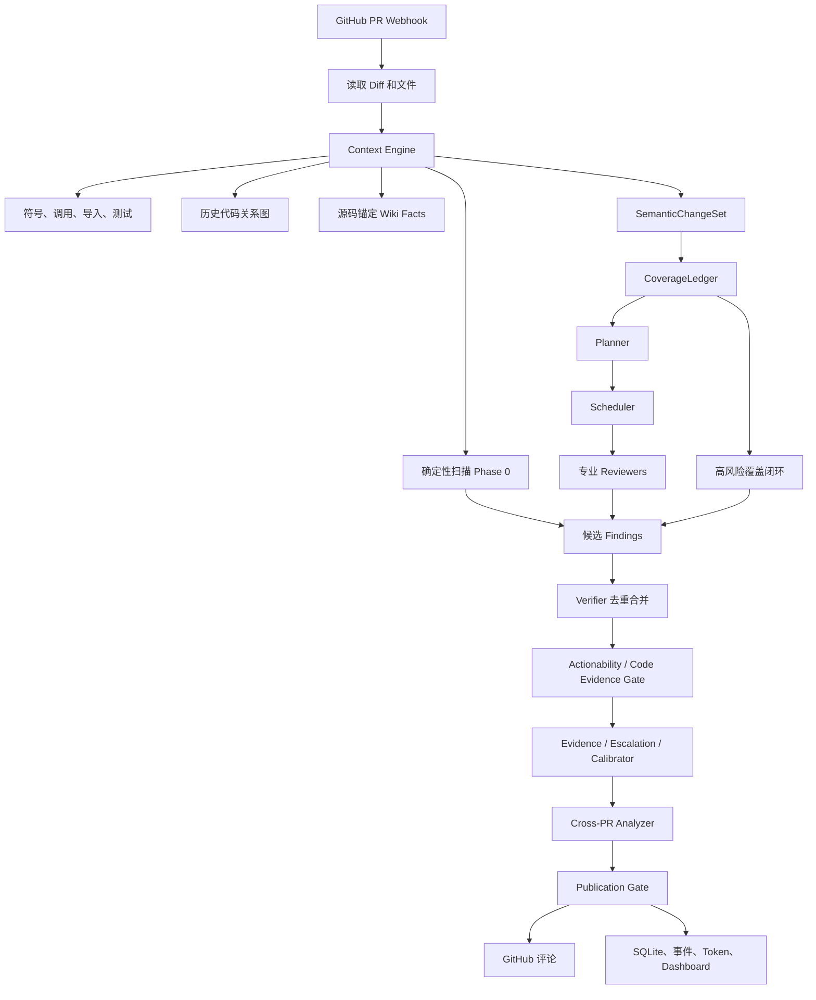
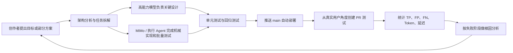

# ReviewForge v3 创作者完全理解与面试表达手册

> 适合项目创作者、产品负责人和非资深工程师阅读。目标不是让你背代码，而是让你真正理解：这个项目为什么存在、整体如何工作、每次迭代解决了什么，以及如何在面试中准确、有深度地介绍它。

---

## 一、先用一句话理解 ReviewForge

ReviewForge 是一个面向 GitHub Pull Request 的 AI 代码审查系统。它不会简单地把整段代码丢给大模型并询问“有没有问题”，而是先理解变更影响范围，再把风险拆给不同专业 Reviewer，最后通过证据、去重、反证和发布闸门，只把相对可信、能定位、能修改的问题发布到 GitHub。

更通俗地说：

> 普通 AI Review 像是请一个聪明人快速扫一遍代码；ReviewForge v3 更像是一套有分工、有案卷、有审计、有复核、有发布标准的审查组织。

这个项目真正有价值的地方不只是“接入了大模型”，而是围绕大模型不稳定、上下文有限、容易误报、成本不可控这些现实问题，设计了一套可观测、可约束、可评测的工程系统。

---

## 二、你应该先掌握的基本概念

### 1. PR 和 Diff

PR（Pull Request）是开发者准备合并到主分支的一组代码改动。

Diff 是“修改前”和“修改后”的差异。它能告诉系统哪些行新增、删除或改变了，但通常不会自动告诉系统：

- 这个函数被谁调用；
- 它修改了什么业务契约；
- 另一个 PR 是否依赖旧行为；
- 对应测试在哪里；
- 这次改动是否影响权限、并发、国际化或数据格式。

所以，只看 Diff 是许多代码审查机器人召回率不足的根源之一。

### 2. Agent

Agent 可以理解为“带角色、规则和工具的大模型执行单元”。

ReviewForge 不让一个 Agent 包办所有事情，而是把职责拆开：

- Planner 决定审查什么；
- Reviewer 从某个专业维度寻找问题；
- Verifier 做确定性去重和合并；
- Calibrator、Escalation、Publication Gate 对问题进行复核；
- Commenter 把最终结果转成 GitHub 评论。

### 3. Precision、Recall 和 F1

这是介绍项目效果时必须说清楚的三个指标。

- Precision（精确率）：系统报出的所有问题中，有多少是真的。精确率低意味着“狼来了”，用户会逐渐不看评论。
- Recall（召回率）：真实存在的问题中，系统找到了多少。召回率低意味着系统看起来很安静，但漏掉了大量缺陷。
- F1：Precision 和 Recall 的综合指标。只有两者相对平衡，F1 才会高。

举例：代码里实际有 10 个问题，系统报了 8 个，其中 6 个是真的。

- Precision = 6 ÷ 8 = 75%
- Recall = 6 ÷ 10 = 60%

代码审查产品最难的不是让模型“多说”，而是在误报和漏报之间取得平衡。

### 4. Token

Token 可以近似理解为模型读写文本时消耗的计费单位。

更多上下文、更多 Agent、更多复核通常能提升效果，但也会增加：

- 成本；
- 延迟；
- 超时概率；
- 模型输出截断和格式错误的概率。

因此 ReviewForge 的目标不是无限堆 Token，而是让 Token 花在高风险、缺证据、值得复核的地方。

### 5. Evidence 和 Abstain

Evidence 是支持或反驳一个问题的代码证据，例如具体文件、行号、调用关系、权限判断或函数契约。

Abstain 是“无法得出可靠结论，暂不发布”。这是 v3 很重要的设计：

> 模型或工具失败，不等于问题不存在；证据不足，也不应该假装确认。

因此系统把“确认”“拒绝”“暂不判断”分开，避免把运行故障错误地当成安全结论。

---

## 三、项目整体架构

### 1. 五层结构

ReviewForge v3 可以记成五层：

| 层级 | 作用 | 关键组件 |
| --- | --- | --- |
| 接入层 | 接收 GitHub 事件，加载 PR 内容 | Webhook、GitHub Client、API Auth |
| 上下文层 | 理解改了什么、影响谁、有哪些历史事实 | Context Engine、Repository Wiki、Code Graph |
| 决策层 | 把风险拆成审查任务并执行 | SemanticChangeSet、CoverageLedger、Planner、Scheduler、Reviewer |
| 质量层 | 去重、找反证、过滤噪声、决定是否发布 | Verifier、Evidence、Escalation、Calibrator、Publication Gate |
| 产品与运维层 | 保存结果、统计成本、展示界面、自动上线 | SQLite、EventBus、Dashboard、Token Tracking、GitHub Actions |

### 2. 总体流程图



### 3. 一次真实审查是怎样发生的

假设一个 PR 修改了 `canManageProject()` 权限函数。

#### 第一步：接收事件

GitHub 把 PR 事件发送给 ReviewForge。系统验证 Webhook 签名，读取仓库、PR 编号、目标 SHA 和文件 Diff。

系统用 `repo + PR + head SHA` 标识一次审查，避免同一个提交被重复执行。

#### 第二步：构建上下文

Context Engine 不只看变更行，还会尝试找出：

- 修改的是哪个函数或类；
- 这个函数调用了谁；
- 谁在调用这个函数；
- 有哪些 import 关系；
- 是否存在相关测试；
- 历史审查中是否记录过相关代码关系；
- 源码中有哪些权限判断、返回值、异常和副作用事实。

最后形成一个有大小上限的 Impact Manifest，也就是“影响面摘要”。

#### 第三步：确定性扫描

一些问题不需要大模型推理，例如明确的危险模式、依赖配置或可验证的代码结构。

这些检测器先运行，即使 Planner 或模型服务故障，确定性发现仍然可以进入后续验证流程。

#### 第四步：把代码变更编译成语义单元

v3 不再只把 PR 当作一堆文件，而是把它编译成 `SemanticChangeSet`。

其中每个 `SemanticUnit` 通常代表：

- 一个被修改的函数；
- 一个类；
- 一个配置区块；
- 一个资源或国际化区域。

每个语义单元带有文件、语言、行号、调用、引用、候选测试、风险信号、Wiki facts 和来源 SHA。

#### 第五步：建立覆盖账本

CoverageLedger 像一张审查清单。

它会记录每个语义单元需要检查哪些维度：

- correctness；
- contract；
- error-handling；
- security；
- testing；
- localization；
- performance；
- compatibility；
- cross-PR。

如果权限函数发生变化，security、contract、correctness 很可能都是必查项。

Planner 可以决定先做什么、派谁做，但它不能直接宣布“已经审完”。是否完成由 CoverageLedger 根据实际任务和证据决定。

#### 第六步：Planner 和 Scheduler 分工

Planner 是指挥者。它根据 Diff、Impact Manifest、已有 Findings 和上一轮 Notes，提出任务：

```text
让 security_reviewer 审查 auth/permission.py
让 correctness_reviewer 审查 permission.py 与调用方 controller.py
让 testing_reviewer 检查对应权限测试
```

Scheduler 是执行调度器。它按优先级和并发上限运行任务，避免所有 Reviewer 无限制同时请求模型。

最多进行有限轮次的重新规划，并使用 Loop Detector 识别重复任务，防止 Agent 在相同文件和相同问题上循环。

#### 第七步：专业 Reviewer 产生候选问题

Reviewer 按专业维度工作。当前内置方向包括：

- 安全；
- 正确性；
- 性能；
- 测试；
- 国际化；
- 依赖；
- 可访问性；
- 文档；
- 风格。

Reviewer 可以获得匹配语言和框架的 Skill，例如 Python correctness、TypeScript correctness、React、Vue、Go、Java、Rust 等。

必要时 Reviewer 能使用受控工具读取文件、搜索代码、查看 Diff 和读取参考规则。工具必须经过 Tool Gateway，Agent 不能随意访问服务器。

#### 第八步：确定性质量过滤

候选问题不会直接发布。

Verifier 首先执行纯逻辑处理：

- 合并重复问题；
- 合并相同根因；
- 修复或统一定位；
- 去掉明显低质量项；
- 保留来源 Reviewer 信息。

接着 Actionability Gate 和 Code Evidence Gate 会过滤：

- 只有“建议多写测试”但没有具体风险的问题；
- 与实际代码结构不符的问题；
- 已被静态事实证明不成立的问题；
- 无法定位到可操作代码的问题。

#### 第九步：复核不确定问题

不同 Findings 会根据风险和置信度走不同路径：

- 中间置信区间、需要追踪调用链的问题交给 Escalation，用有限工具循环补证据；
- 其余候选交给 Dynamic Calibrator，进行对抗式质疑和判断；
- v3 Evidence Verifier 可以构造支持证据、反证和独立裁决；
- 运行失败或证据不足时，结论应为 Abstain，而不是伪装成“没有问题”。

#### 第十步：跨 PR 分析

当前 PR 可能单独看没有问题，但和之前的 PR 组合后产生问题。

例如：

1. PR A 修改了 `getUser()` 的返回值，允许返回 `None`；
2. PR B 的调用方仍假定它永远有值；
3. 两个 PR 单看都可能显得合理，组合后会触发崩溃。

Cross-PR Analyzer 会利用数据库中的符号、调用、import、历史风险和来源 PR，寻找这种生产者—消费者冲突，并要求具体代码流证据。

#### 第十一步：最终发布闸门

Publication Gate 是评论发布前的独立复核。

它不只是重新问模型“你确定吗”，而是要求问题能够回答：

- 触发路径是什么；
- 违反了什么契约；
- 代码证据在哪里；
- 是否存在反证；
- 评论能否落到本次 PR 的有效行。

只有通过发布闸门的问题才会成为 GitHub 评论。

#### 第十二步：持久化和观测

系统将审查记录、Findings、Reviewer 指标、代码关系、Wiki pages 和 Token 使用写入 SQLite。

控制台可以查看：

- 审查历史；
- 问题分类；
- 趋势和热点；
- Reviewer 表现；
- 每次运行和每个 Agent 的 Token 消耗。

---

## 四、四类 Agent 的职责

### Planner：Conductor，指挥者

Planner 每轮进行一次决策调用。

它看的是：

- PR 摘要；
- 影响面；
- 风险信号；
- 已发现的问题；
- 上一轮留下的 Notes。

它输出的是审查任务，而不是最终问题。Planner 不直接调用工具，也不能自行宣布覆盖完成。

这样设计的价值是把“决定查哪里”和“具体怎么查”分开。

### Reviewer：Operative，执行者

Reviewer 是无状态的单任务执行者。

每个 Reviewer 专注一个维度，并可根据任务选择：

- 单次模型调用；
- 有限工具循环；
- 对应语言和框架 Skill；
- 快速模型或高精度模型。

Reviewer 的输出只是 Candidate Finding，不拥有发布权。

### Verifier：Auditor，审计者

Verifier 不依赖大模型，是确定性逻辑。

它负责：

- 去重；
- 合并同根因；
- 处理定位冲突；
- 识别某些检测器与 LLM 的重复结论；
- 降低重复评论对用户的打扰。

### Commenter：Analyst，表达者

Commenter 只消费已经确认的问题，把它转成清晰的 GitHub inline comment。

它不能绕过前面的证据和发布流程创造新问题。

---

## 五、这个项目比较厉害的地方

### 1. 从“自由聊天”升级成“覆盖驱动审查”

很多 AI Review 产品的核心逻辑是：

```text
读取 Diff → 让模型找问题 → 发布
```

ReviewForge v3 的核心逻辑是：

```text
识别语义变更 → 推导必查维度 → 分配任务 → 记录覆盖状态 → 对未覆盖高风险项补审 → 证据复核 → 发布
```

这意味着系统可以解释：

- 为什么审查这个函数；
- 为什么要检查 security；
- 谁检查过；
- 检查了几次；
- 为什么最终关闭这个审查项；
- 是确认、已证明安全，还是证据不足。

这是从 Prompt 工程走向审查系统工程的一步。

### 2. Context Engine 不是简单地“塞更多代码”

上下文越多不一定越好。无边界地塞整个仓库会导致：

- Token 爆炸；
- 模型注意力被稀释；
- 相关事实反而更难被发现；
- 延迟和超时上升。

ReviewForge 的 Context Engine 使用有界策略：

- 最多选择一定数量的文件和符号；
- 优先搜索高风险、非通用符号；
- 限制引用路径和文件读取数量；
- 限制 Wiki 页数和 Prompt 字符数；
- 数据不足时保留 Diff-only 降级路径。

所以它追求的是“高相关度上下文”，而不是“最大上下文”。

### 3. Repository Wiki 是源码事实库，不是模型写的百科

当前 Wiki 和传统向量 RAG 有明显区别。

它不会让模型先总结代码再把总结当事实，因为模型生成的知识库可能把错误长期保存下来。

当前实现会从指定 SHA 的源码中提取：

- 函数签名；
- guard 条件；
- return、raise、throw；
- 副作用；
- async 或并发状态；
- 数据结构；
- 安全边界。

每条事实都带：

- 源文件；
- 源 SHA；
- 起止行；
- 内容哈希。

检索采用 SQLite 中的精确词和词法混合评分，并受页数、字符数限制。Reviewer 使用事实前仍被要求回到原始代码验证。

面试时可以把它称为：

> Revision-anchored、source-grounded 的轻量知识层。

不能把它描述成完整的 embedding + vector database RAG，因为当前最终版没有使用向量数据库。

### 4. 确定性规则和大模型互补

纯规则系统精确但理解能力有限；纯大模型系统灵活但不稳定。

ReviewForge 采用混合架构：

- 明确模式和结构事实由确定性检测器处理；
- 业务语义、契约和跨文件推理由大模型处理；
- 去重、锚点校验和部分反证继续用确定性逻辑；
- 只有不确定且高价值的问题才追加工具和模型成本。

这比“所有事情都问模型”更稳定，也更容易测试。

### 5. 把误报治理做成完整漏斗

系统不是只有一个 confidence threshold，而是多阶段治理：

```text
Candidate
  → 去重与同根因合并
  → 可操作性检查
  → 代码事实检查
  → 证据或升级核验
  → 动态校准
  → 跨 PR 分析
  → 最终发布闸门
```

每个阶段解决不同类型的噪声。这样发生误报时，可以定位是生成、过滤还是发布阶段的问题，而不是只能继续修改一个巨大的 Prompt。

### 6. 跨 PR 不是简单的“搜索历史评论”

Cross-PR Analyzer 保存代码符号和关系，并尝试证明：

- 哪个历史 PR 改变了生产者；
- 当前 PR 的哪个消费者仍使用旧契约；
- import 和调用是否能对应到同一个目标；
- 数据、权限或异常是否真的流过边界。

它针对 Python、TypeScript/JavaScript、Go、Java 等语言做了不同的调用和绑定验证。

跨 PR 问题是多数简单审查机器人难以覆盖的能力，也是项目很适合面试展开的亮点。

### 7. 多语言能力不是只翻译 Prompt

ReviewForge 把通用方法和语言特有知识分开。

通用 Reviewer 负责正确性、安全、测试等维度，Skill 负责补充：

- Python 动态类型、async、序列化等模式；
- TypeScript 类型、ORM、OAuth、异步集合等模式；
- Go、Java、Ruby、Rust 的语言惯例；
- React、Vue、Svelte、Angular 的框架上下文；
- 国际化资源和混合语言文件。

Skill 使用渐进加载，只有语言或框架匹配时才进入 Prompt，避免把所有规则一次性塞给模型。

### 8. Agentic 不是越多越好

项目曾经让更多 Reviewer 使用工具循环，但评测发现：

- Token 明显增加；
- 延迟变长；
- 模型可能重复搜索；
- correctness/testing 的收益不稳定；
- 工具更多不自动等于推理更好。

最终生产配置采取选择性 Agentic：

- Security Reviewer 使用受控工具循环；
- 其他 Reviewer 默认单次执行；
- 中间置信问题通过 Escalation 按需调用工具。

这体现了一个重要工程判断：

> Agentic 是成本较高的能力，应由风险和证据触发，而不是作为产品宣传标签全面开启。

### 9. 故障不会被误认为“审查通过”

项目专门处理了许多真实故障：

- Planner 输出 JSON 损坏；
- Reviewer 输出被截断；
- 模型或工具超时；
- 同一 Webhook 重复投递；
- 服务重启留下 running 状态；
- 评论发送发生暂时性失败；
- Agent 重复规划相同任务。

系统可以：

- 修复或重试格式错误；
- 从数据库恢复未完成任务；
- 对同一 head SHA 去重；
- 把运行故障标为 retryable；
- 保证已发布评论不会重复发送；
- 用 Loop Detector 停止重复任务；
- 将证据不足记为 Abstain。

这让它从 Demo 更接近可以长期运行的工程产品。

### 10. 模型配置可安全热切换

最终版支持单管理员在控制台配置：

- OpenAI 兼容 Base URL；
- API Key；
- 默认模型；
- 快速模型；
- 高精度模型。

安全措施包括：

- 管理 API 受统一 Bearer Token 保护；
- API Key 使用 Fernet 加密落盘；
- 接口不返回完整密钥，只返回配置状态和安全尾号；
- 保存前对所有实际路由模型发起最小请求；
- 默认阻止公网 HTTP、云元数据和内网 SSRF；
- 新运行时先完整构建，成功后原子切换；
- 正在运行的审查继续使用旧快照；
- 可以删除控制台覆盖并恢复环境变量或 YAML。

它没有引入用户、组织、租户和权限表，符合“自己部署、自己使用”的产品定位。

### 11. 评测和 Token 成本是一等公民

ReviewForge 不只记录“发现几个问题”，还记录：

- TP、FP、FN；
- Precision、Recall、F1；
- 严重级别召回；
- 干净 PR 误报；
- 零候选 PR；
- 每次运行 Token；
- 每个 Agent 的 Token；
- 延迟、失败任务和发布结果。

这使优化可以围绕数据进行，而不是只凭“这条评论看起来不错”。

### 12. 自动部署有测试、锁和回滚

推送 `main` 后：

1. GitHub Actions 运行 Ruff；
2. 运行完整 pytest；
3. 构建部署 bundle；
4. 上传服务器；
5. 服务器构建前端并同步 Python 依赖；
6. 重启 systemd 服务；
7. 反复检查 `/health`；
8. 失败时恢复上一提交；
9. 部署锁避免并发发布互相覆盖；
10. 旧的排队任务不能覆盖已经上线的新版本。

这部分说明项目不仅关注模型，也关注真实生产交付。

---

## 六、从早期版本到最终 v3，我们具体迭代了什么

### 我们每一轮使用的迭代闭环

这个项目不是先写一份巨大设计，再一次性完成，而是反复运行下面的闭环：



不同角色的分工是：

- 你负责提出产品方向、效果目标和是否接受架构调整；
- 高能力模型负责架构、风险判断、实验设计和最终验收；
- MiMo 或便宜执行模型负责可明确描述的编码、批量运行、fixture 构造和结果汇总；
- 自动化测试、Benchmark 和真实服务器负责裁决，不能因为代码是强模型写的就免检。

这种方法节省了高价值模型的 Token，但有一个重要前提：

> 便宜模型可以无限执行，错误实现却不能无限进入主分支；任务边界、测试和验收必须比人工开发时更清楚。

实际迭代通常经历：

1. 创建测试分支和多个 PR；
2. 人为埋入安全、跨 PR、多语言、混合语言和干净样本；
3. 让线上 ReviewForge 以真实用户路径进行审查；
4. 统计命中、误报、漏报和 Token；
5. 把问题归类为上下文、路由、生成、过滤、发布或运维故障；
6. 只针对主要瓶颈提出下一轮假设；
7. 修改代码并补回归测试；
8. 推送 `main`，等待自动部署和健康检查；
9. 重新执行测试，确认没有用新能力换来更严重的回归。

早期 v5、v6、v7 fixture 适合快速回归；后期 Martian 50 用来检验系统在更广泛真实 PR 上是否仍然有效。两者不能混为一谈：

- Fixture 回答“刚修的问题有没有重新出现”；
- Holdout Benchmark 回答“系统对没见过的问题到底有多强”。

### 阶段 1：先跑通最小闭环

最早的目标是验证：

```text
GitHub Webhook → Planner → Reviewer → GitHub Comment
```

这一阶段解决了：

- 异步工具和 Webhook 返回类型；
- 后台任务错误日志；
- Reviewer 名称映射；
- LLM JSON 输出解析；
- 中文审查评论；
- 基础安全检测。

这一阶段证明了产品可以工作，但仍然是比较典型的“多 Agent Demo”。

### 阶段 2：产品化和可观测

随后加入：

- Dashboard；
- 多 Reviewer；
- 多模型路由；
- 插件和 Skill；
- SQLite 审查历史；
- Cross-PR 初版；
- Token Tracking；
- 控制台管理；
- 前端统计和热点。

这使项目从一次性脚本变成可以部署、查看、管理的服务。

### 阶段 3：尝试全面 Agentic

项目加入了工具调用循环，让 Reviewer 可以：

- 读取文件；
- 搜索代码；
- 查看 Diff；
- 读取参考规则。

同时建立 A/B 评测框架，比较 single-shot 和 agentic。

评测带来的重要认知是：

> 工具调用能补上下文，但全面 Agentic 会显著增加成本，而且不一定提高总体 F1。

因此后面改成：

- 默认 single-shot；
- Security 选择性 Agentic；
- 不确定问题进入 Escalation；
- 工具调用有步骤和 Token 上限。

这是一次典型的“先验证技术可能性，再按数据收缩架构”。

### 阶段 4：多语言和定向测试

项目加入语言/框架感知 Skill，并构造了多轮 v5、v6、v7 测试：

- 多语言安全问题；
- 多语言混合问题；
- 供应链问题；
- 干净 PR 误报控制；
- Cross-PR 生产者与消费者；
- Rust、Ruby、Vue 等薄弱语言；
- 国际化资源。

这类测试的价值是快速定位回归，但它们是定向 fixture，不等同于未见过的行业基准。

这轮迭代解决了：

- `.vue`、`.svelte` 等语言识别；
- Skill 路由优先级；
- 测试文件误派 Reviewer；
- 多语言安全规则注入；
- 跨 PR import 和调用定位；
- 重复证据合并；
- 一些高频安全误报。

### 阶段 5：从 Diff Review 升级为 Context Engine

随着问题变复杂，仅靠 Diff 无法理解：

- 调用方；
- 历史契约；
- 相关测试；
- 多文件影响；
- 跨 PR 依赖。

因此加入 Repository-aware Context Engine：

- 符号提取；
- import 和 call 提取；
- 引用搜索；
- 候选测试；
- 历史代码图；
- 风险信号；
- 资源文件上下文；
- 源码锚定 Wiki facts。

同时对上下文设置严格预算，避免为了“看得多”让成本失控。

### 阶段 6：Martian 50 暴露架构瓶颈

在提交 `0823da6` 上，项目运行了 Martian 50：

- 50 个 PR；
- 137 个 Golden Findings；
- 5 个项目家族；
- 使用 MiMo v2.5 Pro。

测得：

| 产品/版本 | Precision | Recall | F1 |
| --- | ---: | ---: | ---: |
| ReviewForge `0823da6` | 38.89% | 25.55% | 30.84% |
| 数据集内 Qodo-v2 baseline | 37.09% | 57.66% | 45.14% |

ReviewForge 当时的 Precision 略高 1.8 个百分点，但 Recall 低 32.1 个百分点，F1 低 14.3 个百分点。

其他关键数字：

- 50 个 PR 消耗约 240.9 万 Token；
- 平均每个 PR 约 4.82 万 Token；
- 10/50 PR 完全没有候选问题；
- 137 个真实问题中只命中 35 个；
- High 严重级别召回仅 24.39%；
- Security Reviewer 候选误报率很高；
- Python 和 TypeScript 项目召回尤其弱。

这次评测最重要的结果不是一个分数，而是证明：

> 差距不只是模型差距，更是覆盖、上下文、候选生成和证据流程的架构差距。

如果只继续调 Prompt，很难稳定解决“哪些风险根本没人检查”和“为什么 75K Token 仍然零候选”。

### 阶段 7：重构为 v3 覆盖驱动架构

基于诊断，v3 引入三类核心契约：

#### SemanticChangeSet

把 PR 编译成稳定的语义单元，使审查目标从“文件”变成“具体变更对象”。

#### CoverageLedger

把每个语义单元需要审查的维度显式记录下来，Planner 不再拥有“宣布完成”的权力。

#### EvidenceCapsule

把 Finding、触发路径、违反契约、支持证据、反证、独立裁决和最终状态放进统一证据结构。

随后完成：

- v3 配置开关；
- SemanticChangeSet 和 CoverageLedger 集成；
- 未覆盖高风险项的定向 closure；
- closure 并发和重试；
- Python correctness Skill；
- TypeScript correctness Skill；
- Evidence Verifier；
- Publication Gate；
- 重复验证根因合并；
- 无工具时的确定性发布裁决；
- 高信号 Finding 保留策略。

### 阶段 8：最终工程收口

最终版本又完成了：

- 仓库、历史评测文件和日志整理；
- README 和架构文档重写；
- 自动部署修复；
- 部署锁、健康检查和回滚；
- 单管理员模型配置；
- API Key 加密；
- 模型连接测试；
- 运行时热切换；
- 现有测试扩展到 943 项。

---

## 七、现在的最终 v3 到底开启了哪些能力

当前生产配置不是“所有高级功能全部打开”，而是按已有证据选择。

| 能力 | 当前状态 | 原因 |
| --- | --- | --- |
| v3 SemanticChangeSet | 开启 | 提供语义变更和覆盖基础 |
| CoverageLedger | 开启 | 显式记录风险维度和闭环 |
| Context Engine | 开启 | 为规划和审查提供仓库上下文 |
| Source-grounded Wiki | 开启 | 提供带源码锚点的契约事实 |
| Publication Gate | 开启 | 发布前独立验证高信号问题 |
| Security Agentic | 开启 | 安全问题更依赖证据搜索 |
| 全 Reviewer Agentic | 关闭 | 成本高且总体收益不稳定 |
| Coverage Gap 旧补审 | 关闭 | 早期生产评测未证明收益 |
| v3 Evidence Enforce | 关闭 | 当前 `evidence_mode=off`，实现保留但未作为生产硬门槛 |
| 多模型路由 | 开启 | Planner/普通任务/高精度任务可以分流 |
| 控制台模型热切换 | 开启 | 单管理员可安全更换模型和密钥 |

这体现的是 feature flag 和证据驱动上线，而不是代码写完就全部启用。

---

## 八、我们取得了什么效果

### 已有明确证据的结果

1. 系统已形成真实闭环：GitHub Webhook、审查、评论、历史、Dashboard、自动部署都能工作。
2. 当前代码库完整测试为 943 项，Ruff、格式检查和前端生产构建均通过。
3. `main` 推送后可以自动测试、部署、重启和健康检查，失败可以回滚。
4. 已有统一的 Token、Reviewer、Finding、趋势和热点观测。
5. Martian 50 基线证明当时 Precision 达到 38.89%，但 Recall 和 F1 仍明显落后 Qodo baseline。
6. v3 后续结构性改造已经落地：语义变更、覆盖账本、语言 correctness Skill、证据链和发布闸门都有实现与测试。

### 最终 v3 还不能声称的结果

仓库当前没有保留一次晚期 v3 提交上的完整 Martian 50 重跑产物。

因此不能严谨地说：

- 最终 v3 的 F1 已经达到多少；
- 已经超过 Qodo；
- 已经达到行业第一；
- 某项架构改造一定提升了多少百分点。

正确表达应该是：

> 基线评测揭示了召回短板，随后完成了覆盖驱动和证据驱动的 v3 重构。当前工程能力和可验证性显著增强，但最终效果仍需要在未参与调优的 holdout PR 上重跑，并使用独立裁判确认。

这不是示弱，而是说明你理解评测污染、过拟合和因果归因。

---

## 九、它和 Qodo、Copilot Review、普通机器人有什么区别

### 普通规则机器人

优势：

- 快；
- 便宜；
- 结果稳定；
- 对明确规则精确。

劣势：

- 难理解业务语义；
- 难发现跨文件、跨 PR、契约和权限逻辑问题。

ReviewForge 保留了确定性检测器，但用 LLM 和上下文层覆盖规则难以处理的部分。

### 普通 LLM Review

优势：

- 上手快；
- 能理解自然语言和复杂代码；
- 覆盖面广。

劣势：

- 容易幻觉；
- 缺乏覆盖证明；
- 上下文和成本不可控；
- 同一输入结果可能波动。

ReviewForge 的差异是把模型放进覆盖、证据和发布约束中。

### Qodo / Copilot 等成熟产品

成熟产品可能拥有：

- 更强或专门训练的模型；
- 更成熟的仓库索引；
- 更大的真实用户反馈数据；
- 更好的增量缓存；
- 更复杂的检索和排序；
- 多模型 ensemble；
- 与 IDE、CI、组织规则更深的整合。

ReviewForge 当前的优势不是规模，而是：

- 架构透明；
- 可自部署；
- 可更换任何 OpenAI 兼容模型；
- 覆盖和证据状态可解释；
- 可以针对特定团队修改 Skill、规则和发布标准；
- Cross-PR、Wiki facts 和 Token 归因在同一系统内；
- 没有 SaaS 用户系统和多租户负担。

基于已有 Martian 50 基线，不能说审查效果已经超过 Qodo。可以说：

> 我们的 Precision 在该基线上略高，但 Recall 和 F1 明显落后；因此我们没有继续堆 Prompt，而是针对候选生成和覆盖不可见的问题重构了 v3。

这个回答比空泛声称“效果领先”更专业。

---

## 十、项目目前的局限

### 1. 最终版缺少新的 50 PR holdout 结果

这是当前最重要的验证缺口。

下一次严谨评测应当：

- 固定最终提交；
- 使用未参与 Prompt 和规则开发的 PR；
- 保留完整候选、每个过滤阶段和最终评论；
- 使用独立裁判；
- 同时报告置信区间、严重度和 Token；
- 与同一时间、同一 PR、同一裁判下的竞品结果比较。

### 2. Wiki 不是完整的向量 RAG

当前是源码锚定、精确/词法检索的轻量知识层。

如果仓库非常大，未来可以增加：

- embedding；
- vector store；
- 增量索引；
- AST/调用图与向量混合检索；
- 团队文档和 ADR；
- issue、incident 和历史修复知识。

但必须继续保留源码 SHA 和证据校验，不能让向量召回的旧文档直接成为结论。

### 3. SQLite 更适合单机自部署

当前产品定位是单管理员、自部署，因此 SQLite 很合适：

- 简单；
- 可靠；
- 备份容易；
- 无额外服务。

如果转成 SaaS，需要考虑 PostgreSQL、任务队列、多租户隔离、权限、审计和水平扩展。

### 4. 模型能力仍然决定上限

架构能改善：

- 给模型什么上下文；
- 让谁检查什么；
- 如何补证据；
- 如何过滤噪声。

但如果模型本身无法理解复杂并发、权限或框架契约，架构不能凭空创造推理能力。

更换模型后必须重新做 Precision、Recall、F1 和 Token 评测，不能只看几条示例。

### 5. 更多 Gate 可能伤害 Recall

误报过滤越强，越可能误杀真实问题。

因此每个 Gate 都应该记录：

- 输入了什么；
- 过滤了什么；
- 为什么过滤；
- 后续 Golden Judge 是否证明它误杀。

这也是 v3 把状态和证据显式化的原因。

---

## 十一、面试中怎样介绍这个项目

### 30 秒版本

> 我主导做了一个自部署的 GitHub AI 代码审查系统 ReviewForge。它不是简单把 Diff 发给大模型，而是先通过 Context Engine 建立符号、调用、测试、历史关系和源码事实，再把 PR 编译成语义变更单元，用 CoverageLedger 跟踪安全、正确性、契约、测试和跨 PR 等维度。专业 Reviewer 只生成候选问题，最终还要经过确定性去重、证据校验、对抗式复核和发布闸门。项目支持多语言、Cross-PR、Token 归因、Dashboard、自动部署和模型热切换。

### 90 秒版本

> 我们最初做的是一个 Planner 加多个 Reviewer 的多 Agent Review，但在真实测试中发现，多 Agent 和更多 Token 并不自动带来更好的效果。Martian 50 基线上，当时版本的 Precision 是 38.89%，但 Recall 只有 25.55%，说明最大问题不是误报，而是很多高风险变更根本没有生成候选问题。
>
> 所以后来我主导把核心重构成 v3：先用 Context Engine 找变更符号、调用方、测试和历史关系，再生成 SemanticChangeSet；然后用 CoverageLedger 显式记录每个语义单元必须检查的风险维度。Planner 只能派任务，不能宣布审查完成。Reviewer 的结果还要经过确定性去重、代码证据、Escalation、Calibrator、Cross-PR 和 Publication Gate。
>
> 工程上还做了可恢复执行、重复 Webhook 去重、Token 按 Agent 统计、单管理员控制台、加密 API Key、模型原子热切换，以及 main 分支自动测试、部署、健康检查和回滚。最终版的架构和测试已经完成，但我会明确说明：晚期 v3 还需要一次新的 holdout 50 PR 基准，才能严谨判断是否超过 Qodo。

### 3 分钟版本的表达顺序

记住五句话：

1. 我们解决的是“真实 GitHub PR 审查”，不是代码聊天。
2. 最初多 Agent 方案能跑，但上下文、召回、误报和 Token 不可控。
3. 基准测试证明最大瓶颈是候选生成和覆盖不可见。
4. v3 用 Context、SemanticChangeSet、CoverageLedger 和 Evidence 把自由推理变成受控流水线。
5. 工程闭环已经完成，但最终竞品结论必须由新的 holdout 评测给出。

---

## 十二、你作为“提出部分方案的创造者”应该怎样描述自己的贡献

最可信的说法不是“所有代码都是我一行一行写的”，而是：

> 我负责定义产品目标、提出核心方向、决定取舍、组织真实测试，并根据评测结果推动架构迭代；实现过程中使用 AI coding agents 提高开发效率，但关键架构、验收标准和上线决策由我持续推动。

你可以具体说自己做了这些事：

- 定义目标：做一个自部署、无需用户系统、能真实审查 GitHub PR 的产品；
- 提出多 Agent、Cross-PR、多语言、Wiki/Context 等方向；
- 要求用真实 PR 和竞品基准验证，而不是只看 Demo；
- 观察误报、漏报和 Token，决定是否继续迭代；
- 允许在数据证明架构不足时推翻重做；
- 决定简单任务由便宜模型或执行 Agent 完成，核心架构由高能力模型负责；
- 选择单管理员和安全密钥配置，而不是增加冗余用户系统；
- 要求自动部署、服务器实测和从用户角度验收；
- 接受“当前还没有超过 Qodo”的事实，并继续针对瓶颈重构。

这体现的是产品判断、系统思维、实验意识和 AI 协作开发能力。

---

## 十三、常见面试追问与回答

### 为什么不用一个大模型直接审完整个 PR？

> 因为完整 PR 往往超过有效上下文范围，而且上下文越多，注意力不一定越好。一个模型也很难同时兼顾安全、性能、测试、国际化和跨 PR。我们先构建有界 Impact Manifest，再按风险维度派专业 Reviewer，并用统一质量管线收口。

### 为什么需要 Planner？

> 不同 PR 的风险不同。Planner 负责动态选择 Reviewer 和文件，避免所有 PR 都运行全部 Agent。但 v3 不让 Planner 决定审查是否完成，CoverageLedger 才拥有覆盖状态，防止 Planner 漏派任务后仍然结束。

### 多 Agent 一定比单 Agent 好吗？

> 不一定。多 Agent 会增加上下文重复、Token、延迟和格式错误。我们的测试表明全面 Agentic 收益不稳定，所以最终只对 Security 和中间置信问题使用工具循环，其余任务优先 single-shot。

### Context Engine 和 RAG 有什么区别？

> RAG 是更大的方法类别。我们当前使用的是 source-grounded repository context：基于符号、调用、import、候选测试、历史代码图和源码锚定 Wiki facts 做有界检索。当前没有向量数据库，因此我不会把它包装成完整向量 RAG。

### Wiki 为什么不让模型自动总结？

> 因为模型总结可能产生幻觉并长期污染知识库。我们的 Wiki 从指定 SHA 的源码提取事实，每条事实有文件、行号和哈希，Reviewer 仍必须回源验证。

### 如何降低误报？

> 我们用多层漏斗：确定性去重、同根因合并、定位修复、可操作性 Gate、代码事实 Gate、Escalation、Calibrator 和 Publication Gate。关键不是多设一个阈值，而是让不同阶段过滤不同类型的噪声并保留原因。

### 如何提高召回？

> 召回的核心不是放松所有 Gate，而是先保证高风险语义单元真的被检查。v3 用 CoverageLedger 显式追踪维度，对未覆盖高风险单元进行 bounded closure，并增加语言正确性 Skill 和跨文件上下文。

### 运行故障会不会被当成没有问题？

> 不会。关键运行故障会被标记为 retryable，Evidence 流程中的证据不足应为 Abstain。同一个 head SHA 可以恢复未完成运行，已发布评论不会重复发送。

### Cross-PR 是怎么做的？

> 系统在 SQLite 保存符号、调用、import、历史风险和 PR 来源。新 PR 审查时，会寻找生产者契约变化与消费者旧用法之间的链路，并做语言相关的绑定和数据流证明，不只是搜索相似评论。

### 为什么选择 SQLite？

> 产品是单管理员自部署，不需要多租户。SQLite 部署简单、备份方便、足以承载当前审查历史、代码图、Wiki 和 Token。若转 SaaS，再迁移 PostgreSQL 和任务队列。

### 如何安全保存模型 API Key？

> 管理 API 用 Bearer Token；Key 使用 Fernet 加密；主密钥可以来自环境变量；接口不回传完整 Key；保存前测试所有路由模型；Base URL 有 SSRF 防护；新运行时构建成功后再原子替换。

### 更换模型会怎样？

> OpenAI 兼容模型可以直接切换，但效果不能凭模型榜单判断。必须重跑同一 holdout，比较各严重度 Precision、Recall、F1、延迟和 Token。不同模型还可能影响 JSON 稳定性、工具调用和长上下文能力。

### 你们超过 Qodo 了吗？

> 基于现有 Martian 50 基线，不能这么说。当时 ReviewForge Precision 略高，但 Recall 和 F1 明显低于 Qodo。之后我们完成了 v3 架构重构，但还缺最终版在未见 holdout 上的完整重跑，所以我不会做没有证据的领先声明。

### 这个项目最难的部分是什么？

> 最难的不是接入模型，而是建立可归因的质量闭环。一个漏报可能发生在上下文、任务分配、候选生成、过滤或发布任一阶段。如果没有中间状态和证据，只能盲目改 Prompt。v3 的核心就是把这些阶段显式化。

### 如果继续优化，下一步是什么？

> 第一优先级是冻结最终 v3，在未参与调优的 50 PR holdout 上重跑，并保存每个阶段的候选和淘汰原因。然后按 FN 所在阶段决定优化 Context、Reviewer 还是 Gate，而不是直接继续堆 Agent。

---

## 十四、白板讲解方法

面试时只画五个大框：

```text
GitHub
  ↓
Context
  ↓
Coverage + Planner + Reviewers
  ↓
Evidence + Gates
  ↓
Comments + DB + Dashboard
```

然后补充两条侧线：

```text
历史 DB ──→ Context / Cross-PR
Token & Events ──→ Dashboard / Evaluation
```

讲每个框时只回答三个问题：

1. 输入是什么？
2. 它解决什么失败模式？
3. 输出交给谁？

这样不容易陷入代码细节，也能表现出架构思维。

---

## 十五、推荐的现场演示顺序

1. 打开 Dashboard，说明它记录真实审查、问题和 Token。
2. 打开一个 PR，展示 ReviewForge inline comment。
3. 指出评论中的文件、行号、严重度、证据和修复建议。
4. 展示跨 PR 或多语言案例。
5. 打开 Token 页面，解释为什么成本也要测量。
6. 打开“系统信息 → 模型服务”，说明单管理员、加密 Key 和热切换。
7. 展示 GitHub Actions，说明 main 推送如何自动测试和部署。
8. 最后主动展示 Benchmark Diagnosis，诚实解释基线短板和 v3 重构动机。

主动讲失败和改进通常比只展示成功 Demo 更能证明你真正做过项目。

---

## 十六、代码地图

| 位置 | 作用 |
| --- | --- |
| `backend/src/reviewforge/app.py` | 组装 FastAPI、数据库、运行时和路由 |
| `backend/src/reviewforge/api/webhook.py` | 接收 GitHub PR 事件 |
| `backend/src/reviewforge/engine/orchestrator.py` | 整条审查流水线的中央编排 |
| `backend/src/reviewforge/engine/context_engine.py` | 构建 Impact Manifest |
| `backend/src/reviewforge/engine/wiki_compiler.py` | 生成源码锚定 Wiki facts |
| `backend/src/reviewforge/engine/semantic_diff.py` | 编译 SemanticChangeSet |
| `backend/src/reviewforge/engine/coverage_ledger.py` | 管理审查覆盖状态 |
| `backend/src/reviewforge/engine/planner.py` | 生成 Reviewer 任务 |
| `backend/src/reviewforge/core/scheduler.py` | 任务优先级和并发调度 |
| `backend/src/reviewforge/engine/reviewers.py` | 专业 Reviewer 实现 |
| `backend/src/reviewforge/engine/verifier.py` | 纯逻辑去重与合并 |
| `backend/src/reviewforge/engine/escalation.py` | 对不确定问题补证据 |
| `backend/src/reviewforge/engine/calibrator.py` | 对抗式复核 |
| `backend/src/reviewforge/engine/evidence_verifier.py` | EvidenceCapsule 与独立裁决 |
| `backend/src/reviewforge/engine/cross_pr_analyzer.py` | 跨 PR 关系与风险分析 |
| `backend/src/reviewforge/core/database.py` | 审查、代码图、Wiki、Token 持久化 |
| `backend/src/reviewforge/core/llm_settings.py` | 模型配置加密、脱敏和连接验证 |
| `backend/src/reviewforge/core/runtime.py` | 模型运行时快照和原子切换 |
| `backend/src/reviewforge/skills/` | 语言、框架和审查方法 |
| `frontend/src/` | Dashboard 和单管理员控制台 |
| `backend/eval/` | 评测定义 |
| `backend/scripts/` | Gauntlet 和 Live Benchmark 入口 |
| `.github/workflows/deploy.yml` | main 自动测试与部署 |
| `scripts/deploy.sh` | 服务器部署、健康检查和回滚 |

---

## 十七、最后需要记住的十句话

1. ReviewForge 是代码审查系统，不是代码聊天机器人。
2. 核心矛盾是 Precision、Recall、Token 和延迟的平衡。
3. Context Engine 提供有界、高相关、源码可验证的上下文。
4. SemanticChangeSet 把文件 Diff 变成语义变更单元。
5. CoverageLedger 让“审查过什么”成为显式状态。
6. Reviewer 只产生候选问题，没有发布权。
7. Evidence、Verifier、Calibrator 和 Publication Gate 共同控制误报。
8. Cross-PR 通过历史符号和调用关系发现组合风险。
9. 全面 Agentic 不一定更好，按风险选择工具才更合理。
10. 当前架构已经完成，但是否超过竞品必须由最终 holdout Benchmark 证明。

---

## 十八、一个适合结尾的项目总结

> ReviewForge 的迭代过程让我认识到，AI 工程的难点不是让模型输出一次看起来聪明的答案，而是把不稳定的模型能力组织成一个可验证、可恢复、可度量的系统。我们从最初的多 Agent Demo，经历多语言、工具调用、Cross-PR、Context Engine 和真实 50 PR 基准，最终把核心重构为 SemanticChangeSet、CoverageLedger 和 Evidence 驱动的 v3。它目前已经具备真实部署和持续迭代能力，而下一阶段的重点不是继续堆功能，而是在冻结版本后用新的 holdout 数据证明这些架构改造究竟带来了多少效果。
